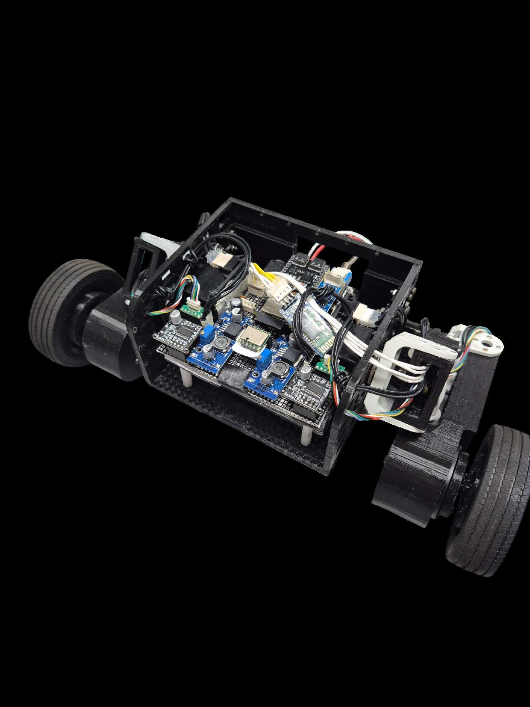
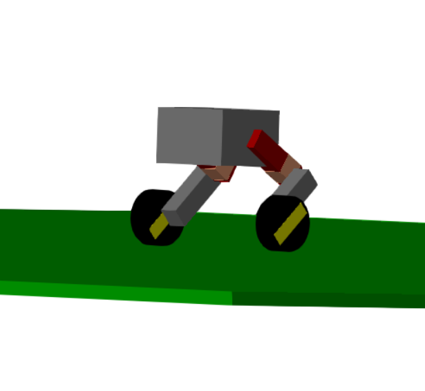
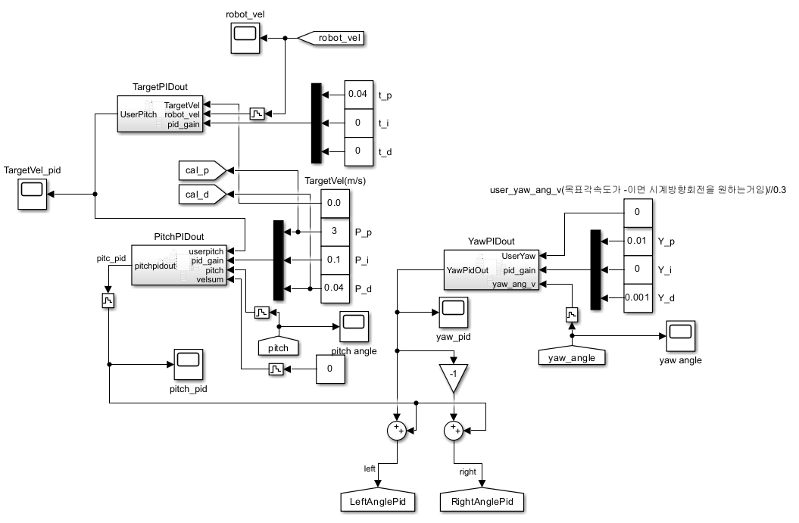
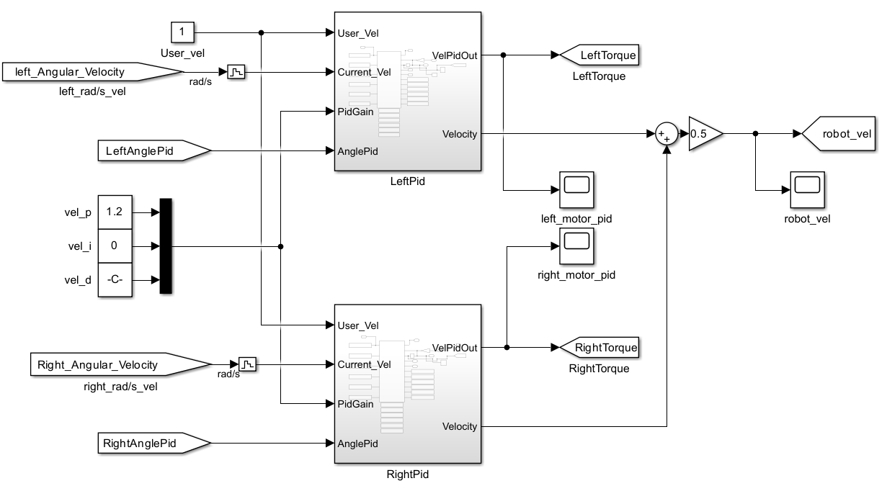
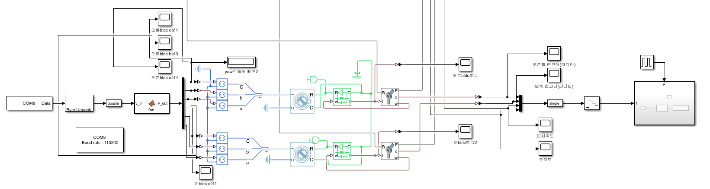
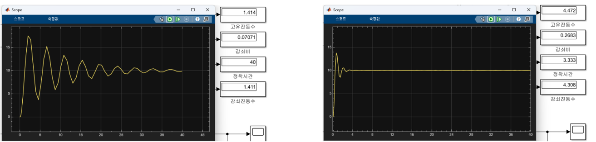

# ESP32 Self-Balancing Robot with HIL Simulation

This repository contains the ESP-IDF firmware for a sophisticated two-wheeled self-balancing robot. The project's core is an advanced control system featuring multiple PID loops. A key aspect of this project is its integration with a Hardware-in-the-Loop (HIL) simulation environment using MATLAB/Simulink, allowing for robust algorithm development and tuning.

---

## Features

- **Advanced Multi-PID Control**: Implements separate, tunable PID controllers for pitch (balance), yaw (rotation), velocity, and roll, enabling highly stable and responsive behavior.
- **Hardware-in-the-Loop (HIL) Simulation**: Communicates directly with MATLAB/Simulink via UART. The ESP32 can receive simulated sensor data and send back calculated motor outputs, allowing for rapid and safe controller tuning without physical hardware.
- **Real-Time & Multi-Tasking**: Built on the ESP-IDF and FreeRTOS, with critical operations like HIL communication and motor control separated into high-priority, real-time tasks.
- **Modular and Abstracted Drivers**: The code is organized into discrete modules for each hardware component, making it clean and extensible.
- **Support for Advanced Hardware**: Includes drivers for high-performance Dynamixel RX-28 servos, a LiDAR sensor for distance measurement, and an HC-06 Bluetooth module for wireless communication.

---

## System Design & Control Logic

The robot's stability is maintained by a control system that primarily runs within a FreeRTOS task. The firmware is designed with two main operational modes:

### 1. HIL Simulation Mode

This is the primary mode demonstrated in `app_main.c`.
- The `hils_task` establishes a UART connection with a MATLAB/Simulink host.
- It continuously waits for a `SimulinkRxPacket` which contains simulated sensor states (e.g., pitch angle from Simulink).
- This data is fed into the onboard PID controllers (`pitch_ctrl`, `yaw_ctrl`, etc.).
- The calculated output voltages (`Vq_left`, `Vq_right`) are packaged into a `HILSTxPacket` and sent back to Simulink for analysis.
- This loop allows for the complete control algorithm to be tested and tuned virtually.

### 2. Physical Hardware Mode

While the HIL task is prioritized in the current code, the project is structured to run on physical hardware. By enabling the respective drivers in `app_main.c`, the system can use real-world sensor data.
- The `imu_timer_init()` and `encoder_timer_init()` set up hardware interrupts to gather data from the IMU (at 200Hz) and motor encoders (at 1KHz).
- This data would then be used by the PID controllers to command the motors (`rx28.c` or `pwm.c`).

---

## Validation & Project Visuals

The following materials summarize how the balancing robot was verified from simulation to hardware, and show the controller blocks used during development.

### 1. Physical Robot and Simulation Model

<p align="center">
  
  
</p>

- **Physical robot**: Actual two-wheeled balancing robot platform used for firmware and controller testing.
- **Simulation model**: Robot model used during controller development before full hardware verification.

### 2. Controller Design

<p align="center">
  
  
</p>

- **Angle controller**: Controller structure for stabilizing the robot posture.
- **Motor controller**: Motor-side control block used to generate the actuation command.

### 3. HILS Simulation Block Diagram

<p align="center">
  
</p>

This MATLAB/Simulink block diagram was used to connect the embedded controller with the simulation environment during HILS validation, making it possible to check the control flow and data exchange before fully relying on hardware tests.

### 4. SILS Validation Result

<p align="center">
  
</p>

Before moving to physical testing, the control response was checked through SILS-based validation to confirm that the balancing controller behaved as expected under the designed conditions.

### 5. Additional Evidence

- [Balancing Robot Evidence PDF](docs/images/balancing_robot_evidence.pdf)

---

## Hardware Components

This project is designed to interface with the following components:
- **MCU**: ESP32 Development Board
- **Motors**: Dynamixel RX-28 Servos (or standard DC motors with encoders)
- **Motor Driver**: Appropriate driver for the chosen motors.
- **IMU Sensor**: For orientation and angle measurement.
- **Distance Sensor**: LiDAR module.
- **Wireless Communication**: HC-06 Bluetooth module.
- **Power**: A suitable battery and voltage regulation circuit.

---

## Software & Setup

This firmware is developed using the Espressif IoT Development Framework (ESP-IDF).

### Prerequisites
- A working installation of the ESP-IDF toolchain.
- For HIL simulation, a MATLAB/Simulink environment configured to communicate over a serial port.

### Build and Flash
1.  Navigate to the project root directory (`C:\esp32\balancing_robot\main`).
2.  Open an ESP-IDF command prompt.
3.  Build the project:
    ```bash
    idf.py build
    ```
4.  Flash the firmware to the ESP32 (replace `(PORT)` with your device's COM port):
    ```bash
    idf.py -p (PORT) flash
    ```
5.  To view console output, run the monitor:
    ```bash
    idf.py -p (PORT) monitor
    ```

---

## Project Structure

A brief overview of the key source files:

| File | Description |
| :--- | :--- |
| `app_main.c` | Main application entry point. Handles initialization of modules and creation of FreeRTOS tasks. |
| `pid.c` / `.h` | Contains the implementation of the PID control algorithm. |
| `imu.c` / `.h` | Driver and data processing logic for the IMU sensor. |
| `encoder.c` / `.h` | Driver for reading motor encoder values. |
| `pwm.c` / `.h` | Low-level functions for generating PWM signals for motor control. |
| `rx28.c` / `.h` | Specific driver for controlling Dynamixel RX-28 servos. |
| `lidar.c` / `.h` | Driver for interfacing with the LiDAR sensor. |
| `hc06.c` / `.h` | Driver for handling communication with the HC-06 Bluetooth module. |
| `variable.h` | Defines shared global variables and constants used across the project. |

