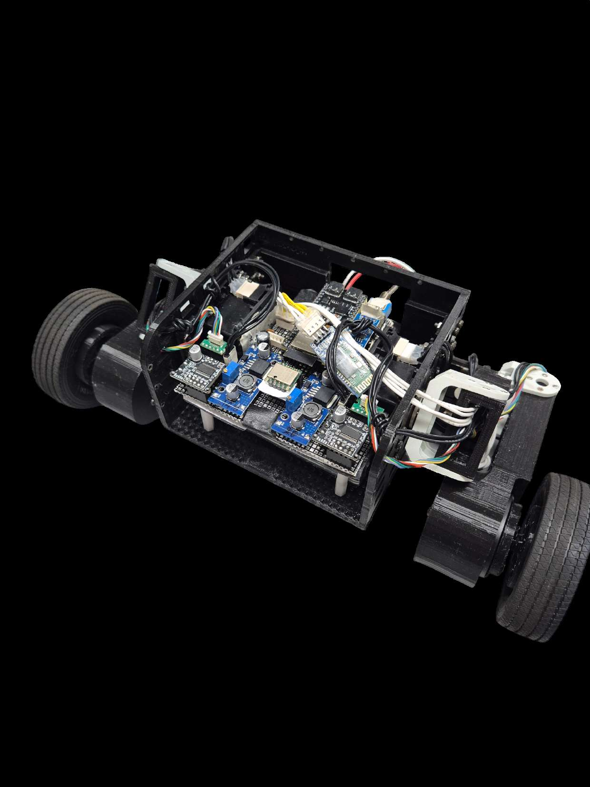
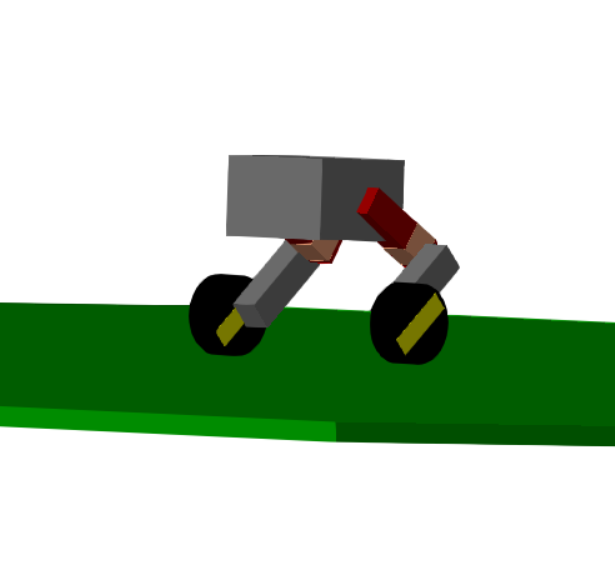
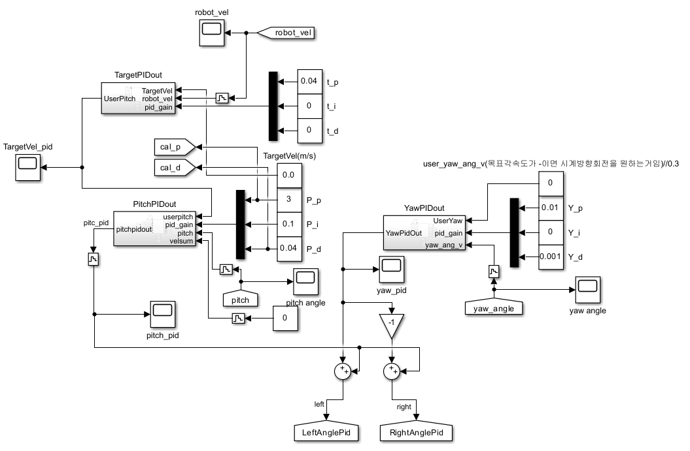
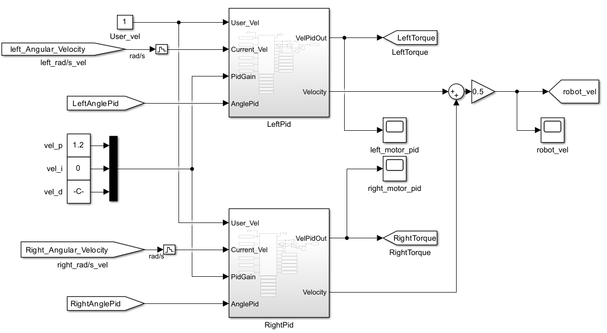
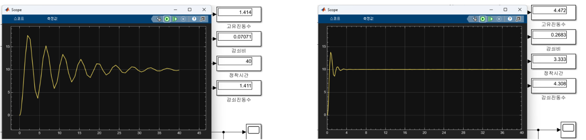
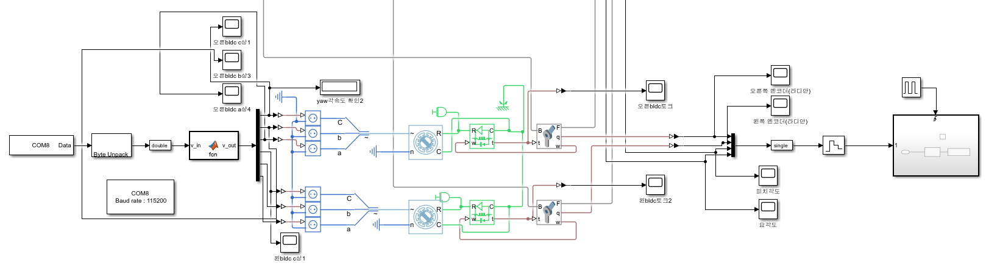

# ESP32 Self-Balancing Robot with HILS, SILS, and Real-World Validation

This repository contains the ESP-IDF firmware for a two-wheeled self-balancing robot. The project was validated in three stages: HILS (Hardware-in-the-Loop Simulation) for communication and control-chain verification, SILS (Software-in-the-Loop Simulation) for controller response checks, and physical-world testing for disturbance rejection and Bluetooth teleoperation.

---

## Features

- **Cascaded balance control**: The firmware converts target velocity into target pitch, then converts target pitch into motor q-axis voltage for upright balancing.
- **Differential yaw control**: Steering is injected as a bounded left/right voltage difference without breaking the main balance loop.
- **Real-time sensing and actuation**: The IMU loop runs at 200 Hz while the encoder and motor commutation path runs at 1 kHz.
- **MATLAB/Simulink HILS workflow**: The project includes a documented serial-based HILS pipeline for testing the control chain before full hardware deployment.
- **Wireless command input**: An HC-06 Bluetooth module is used to receive joystick commands and translate them into velocity and yaw references.
- **Exact hardware stack**: The final build uses dual GM4108H-120T BLDC wheel motors, dual MKS SimpleFOC MINI driver boards, four Dynamixel RX-28 actuators, an ESP32-S3-WROOM-1 N16R8 controller, WT901 IMU, AS5048A magnetic encoders, MAX485, XL6009 converters, and a 3S LiPo battery.

---

## System Design & Control Logic

### 1. Main balance loop

The control loop is split across two timing domains. `imu_timer_init()` starts the 200 Hz IMU update cycle, and `imu_data_cal()` refreshes `current_pitch`, `current_yaw`, and `current_roll`. In parallel, `encoder_timer_init()` starts the 1 kHz encoder path, and `motor_control_task()` wakes on the encoder semaphore to execute `encoder_to_vcc_cal()`.

Inside `app_main.c`, the outer velocity loop converts `targetvel_vel` into `target_pitch`. That target is smoothed before being passed into the pitch loop, which reduces oscillation when speed commands change. A separate yaw command is turned into a bounded differential term, then mixed with the pitch output to produce `Vq_left` and `Vq_right`.

Inside `encoder.c`, the motor-side loop reconstructs left and right encoder angles, estimates wheel speed, converts the q-axis voltages into electrical angles, and finally generates six phase voltages for the two BLDC motors. Those voltages are applied through `mcpwm_set_voltage()` in `pwm.c`.

### 2. Command input path

`hc06.c` receives joystick packets in the `S,x,y,diff,E` format over UART2. The parser recenters the joystick coordinates, suppresses small steering noise with a deadband, and maps the joystick magnitude to either a stop command or a forward velocity target. This keeps wireless control simple while still exercising the real balance and steering logic.

### 3. Additional hardware support

`rx28.c` runs a dedicated FreeRTOS task for four Dynamixel RX-28 actuators through a MAX485 TTL-to-RS-485 link. `lidar.c` contains experimental YDLIDAR G2 support, and `variable.h` also reserves HILS-oriented shared variables such as `hils_angle_l`, `hils_angle_r`, `hils_pitch`, `hils_yaw`, and `hils_v_out[6]` for extended simulation workflows.

---

## Validation & Project Visuals

The following materials summarize how the balancing robot was verified from simulation to hardware, and show the controller blocks used during development.

### 1. Physical Robot and Simulation Model

<p align="center">
  
  
</p>

- **Physical robot**: Actual two-wheeled balancing robot platform used for firmware and controller testing.
- **Simulation model**: Robot model used during controller development before full hardware verification.

### 2. Controller Design

<p align="center">
  
  
</p>

- **Angle controller**: Controller structure for stabilizing the robot posture.
- **Motor controller**: Motor-side control block used to generate the actuation command.

### 3. SILS Validation Result

<p align="center">
  
</p>

Before moving to physical testing, the control response was checked through SILS-based validation to confirm that the balancing controller behaved as expected under the designed conditions.

### 4. HILS Simulation Block Diagram



This MATLAB/Simulink block diagram was used to connect the embedded controller with the simulation environment during HILS validation, making it possible to check the control flow and data exchange before fully relying on hardware tests.

The HILS communication flow was documented separately in `hils_flow.pdf`, and the implementation follows that same structure. A CP2102 USB-to-TTL module is used as the serial bridge between the PC and ESP32 UART2, with ESP32 TX on GPIO17 and RX on GPIO18. In this setup, MATLAB/Simulink sends simulated sensor states to the firmware, and the firmware returns the motor-side three-phase voltage commands that would be applied to the left and right BLDC motors.

On the `MATLAB -> ESP32` path, the packet contains four `single` values: left encoder angle, right encoder angle, pitch, and yaw. Each `single` occupies 4 bytes, so one packet is 16 bytes in total. The HILS flow document states that encoder-side data is refreshed at 1 kHz, while pitch and yaw are refreshed at 200 Hz. With a 1 kHz transmit rate, the raw payload is `16 bytes * 1000 = 16000 bytes/s`. After accounting for UART framing overhead, the document estimates the line requirement at about `160000 bps`, which is why the project uses `921600 bps` to leave enough communication margin.

On the `ESP32 -> MATLAB` path, the firmware first uses the 200 Hz attitude update to generate `Vq_left` and `Vq_right`, then uses the 1 kHz encoder-side loop to expand those values into six three-phase voltages for the two BLDC motors. Those six phase-voltage values are returned to MATLAB as one 24-byte packet because `6 floats * 4 bytes = 24 bytes`. In Simulink, `Serial Receive` first reads the 24-byte `uint8` payload, and `Byte Unpack` reconstructs the six `single` values so the virtual plant can apply the same motor commands that would be used on hardware.

### 5. Demonstration Videos

GitHub does not reliably inline-play repository `mp4` files inside `README.md`, so the videos below are linked directly.

- [HILS test video](docs/videos/hils_test.mp4)
- [SILS yaw test video](docs/videos/sils_yaw_test.mp4)
- [SILS target velocity test video](docs/videos/sils_target_velocity_test.mp4)
- [Physical-world disturbance rejection video](docs/videos/real_world_disturbance_rejection.mp4)
- [Physical-world hold-position video](docs/videos/real_world_hold_position_after_disturbance.mp4)
- [Physical-world Bluetooth teleoperation video](docs/videos/real_world_bluetooth_control.mp4)
- [HILS communication flow reference](docs/references/hils_flow.pdf)

### 6. Additional Evidence

- [Balancing Robot Evidence PDF](docs/images/balancing_robot_evidence.pdf)

---

## Hardware Components

This project uses the following modules in the final hardware stack:

- **Main controller**: ESP32-S3-WROOM-1 N16R8
- **Wheel motors**: GM4108H-120T BLDC motors x2
- **Wheel motor drivers**: MKS SimpleFOC MINI BLDC motor driver boards x2
- **Wheel encoders**: AS5048A magnetic SPI encoders x2
- **Leg actuators**: Dynamixel RX-28 x4
- **Servo bus interface**: MAX485 TTL-to-RS-485 converter module
- **IMU sensor**: WT901
- **Wireless control**: HC-06 Bluetooth UART module
- **HILS serial bridge**: CP2102 USB-to-TTL module
- **Power**: 3S LiPo battery and XL6009 boost converters

Additional lab and expansion modules referenced in the project:

- **Dynamixel test interface**: U2D2 and U2D2 Power Hub
- **Optional ranging module**: YDLIDAR G2 support exists in firmware
- **Not used in final build**: MPU6050 was evaluated but replaced by WT901

---

## Software & Setup

This firmware is developed using the Espressif IoT Development Framework (ESP-IDF).

### Prerequisites

- A working installation of the ESP-IDF toolchain
- For HILS, a MATLAB/Simulink environment configured for serial communication

### Build and Flash

1. Navigate to the project root directory.
2. Open an ESP-IDF command prompt.
3. Build the project:

```bash
idf.py build
```

4. Flash the firmware to the ESP32:

```bash
idf.py -p (PORT) flash
```

5. Open the serial monitor if needed:

```bash
idf.py -p (PORT) monitor
```

---

## Project Structure

| File | Description |
| :--- | :--- |
| `app_main.c` | Main application entry point. Initializes the control loops, tasks, and shared state. |
| `pid.c` / `pid.h` | PID controller implementation used by the velocity and pitch loops. |
| `imu.c` / `imu.h` | WT901 initialization, timer scheduling, and attitude data acquisition. |
| `encoder.c` / `encoder.h` | Encoder acquisition, velocity estimation, and motor phase-voltage generation. |
| `pwm.c` / `pwm.h` | Low-level MCPWM voltage application for the six motor phases. |
| `hc06.c` / `hc06.h` | Bluetooth command input and parsing logic. |
| `rx28.c` / `rx28.h` | RX-28 actuator control task and interpolation logic. |
| `lidar.c` / `lidar.h` | LiDAR UART interface for future sensing extensions. |
| `variable.h` | Shared constants, globals, and cross-module control variables. |
