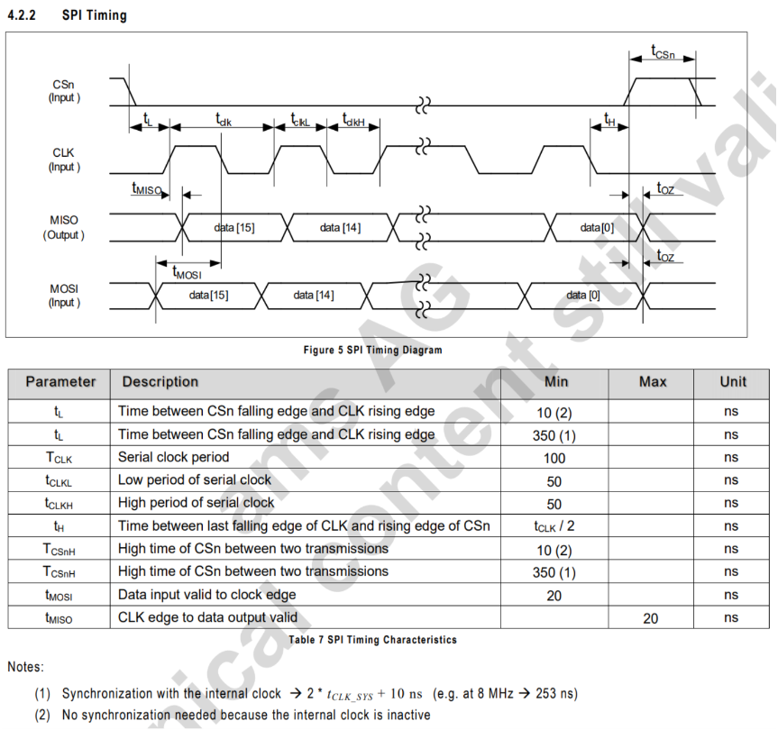

# ESP32 셀프 밸런싱 로봇

이 저장소는 `ESP32-S3` 기반 2륜 셀프 밸런싱 로봇의 제어 코드와 검증 자료를 정리한 프로젝트입니다.

프로젝트의 목표는 기지국에서 전달한 GPS 웨이포인트를 순서대로 따라가며 사람을 수색할 수 있는 로봇을 만드는 것이었습니다. 로봇은 현재 위치와 목표점을 로컬 `x/y` 좌표로 바꾸고, `MPPI` 제어기로 목표 속도와 목표 각속도를 계산합니다. 이 명령은 바로 모터로 들어가지 않습니다. 속도, 자세, 요 제어용 `PID`를 거친 뒤 왼쪽과 오른쪽 바퀴의 `Vq` 명령으로 나뉘고, 마지막으로 엔코더 각도를 이용한 역 DQ 변환을 통해 BLDC 3상 전압으로 출력됩니다.

실물 로봇을 바로 튜닝하지 않았습니다. 먼저 MATLAB에서 MPPI 명령 생성 로직을 확인했습니다. 이후 `SILS`와 `HILS`로 PID 제어 흐름과 ESP32 펌웨어 통신 구조를 검증했습니다. 마지막 단계에서 실물 로봇으로 외란 복귀, 목표 속도 추종, 블루투스 수동 조작을 확인했습니다.

---

## 전체 제어 흐름

```text
기지국 GPS 웨이포인트
-> GNSS 로컬 좌표 변환
-> 웨이포인트 관리자
-> MPPI 제어기: v_ref, w_ref 생성
-> 속도 PID: 목표 피치 생성
-> 피치 PID + 요 제어: 좌우 Vq 생성
-> 엔코더 각도 보정
-> 역 DQ 변환
-> BLDC 3상 전압 출력
```

이 구조에서 MPPI는 "어디로 갈지"를 결정합니다. PID는 "넘어지지 않고 그 명령을 따라가는 방법"을 담당합니다. DQ 변환은 "계산된 전압 명령을 실제 BLDC 모터가 사용할 3상 전압으로 바꾸는 단계"입니다.

---

## 구현 범위

- ESP32-S3 기반 셀프 밸런싱 제어 루프를 구현했습니다.
- 기지국 GPS 웨이포인트를 순서대로 따라가는 GNSS 미션 레이어를 구성했습니다.
- MPPI 제어기로 목표 속도와 목표 각속도를 생성했습니다.
- MATLAB MPPI 시뮬레이션으로 펌웨어 적용 전 명령 생성 로직을 확인했습니다.
- 속도, 피치, 요 제어가 이어지는 캐스케이드 PID 구조를 구성했습니다.
- 엔코더 기반 속도 추정과 BLDC 3상 전압 생성을 구현했습니다.
- 블루투스 조이스틱 입력으로 실물 밸런싱과 수동 조작을 확인했습니다.
- MATLAB/Simulink HILS를 구성해 실제 ESP32 펌웨어와 가상 모델의 데이터 교환을 검증했습니다.
- RX-28 관절 액추에이터와 YDLIDAR G2 확장 코드를 함께 정리했습니다.

---

## Control Architecture

### 1. MPPI: 웨이포인트를 속도와 각속도 명령으로 바꾸는 상위 제어기

MPPI는 로봇의 현재 상태와 목표점을 보고 여러 개의 미래 명령열을 샘플링합니다. 각 명령열은 `v_ref`와 `w_ref`로 구성됩니다. 로봇이 그 명령을 따른다고 가정하고 미래 위치를 예측한 뒤, 목표점과 장애물 기준으로 비용을 계산합니다. 비용이 낮은 명령열에 더 큰 가중치를 주고, 가중 평균으로 최종 명령열을 만듭니다.

ESP32 펌웨어에서는 `SoftWare/Gnss_Mppi` 폴더가 이 역할을 담당합니다.

- `gnss.c`: 현재 GNSS 위치와 목표 웨이포인트를 로컬 `x/y` 좌표로 변환합니다.
- `waypoint.c`: 기지국에서 받은 웨이포인트를 순서대로 목표점에 넣고, 목표 반경 안에 들어오면 다음 웨이포인트로 넘깁니다.
- `mppi.c`: 후보 명령열을 만들고, 예측 상태를 계산하고, 가중 평균으로 최종 `v_ref`, `w_ref`를 선택합니다.
- `cost.c`: 목표점 오차, 장애물 거리, 입력 크기, 입력 변화량을 비용으로 계산합니다.
- `lidar.c`: 라이다 거리 데이터를 받아 장애물 정보를 구성합니다.

장애물은 360도를 `24`개 섹터로 나눠 저장합니다. 한 섹터에 여러 장애물이 들어오면 가장 가까운 장애물 하나만 대표값으로 사용합니다. 비용 계산에서는 현재 스캔 원점과 섹터 각도를 이용해 장애물의 월드 좌표를 만들고, 예측된 로봇 위치가 안전거리 안으로 들어가면 비용을 추가합니다.

MPPI 계산 순서는 다음과 같습니다.

1. 이전 최적 명령열을 한 칸 앞으로 당겨 현재 샘플링의 기준 명령열로 사용합니다.
2. 기준 명령열에 랜덤 노이즈를 더해 후보 명령열을 만듭니다.
3. 각 후보 명령열을 적용했을 때의 미래 로봇 상태를 예측합니다.
4. 예측 상태마다 목표점 비용, 장애물 비용, 입력 비용, 입력 변화 비용을 더합니다.
5. 비용을 `exp(-(J_i - J_min) / lambda)` 형태의 가중치로 바꿉니다.
6. 모든 후보 명령열을 가중 평균하고, 첫 번째 입력만 실제 로봇 명령으로 사용합니다.

현재 ESP32 MPPI 초기값은 임베디드 계산량을 고려해 짧은 예측 구간으로 잡았습니다.

- 제어 주기: `dt = 0.1 s`
- 예측 스텝: `horizon = 6`
- 후보 명령열: `num_samples = 64`
- 속도 범위: `-0.5 m/s` ~ `0.5 m/s`
- 각속도 범위: `-1.2 rad/s` ~ `1.2 rad/s`
- MPPI 온도 파라미터: `lambda = 10.0`
- 장애물 안전거리: `0.5 m`

MATLAB에서는 같은 구조를 더 넓은 환경에서 먼저 확인했습니다. 코드는 `SoftWare/Mppi_matlab_simulation`에 정리했습니다.

- `main.m`: 시뮬레이션 시작점, 목표점, 장애물, 반복 루프를 설정합니다.
- `mppi/init_mppi_params.m`: MPPI 파라미터와 비용 가중치를 설정합니다.
- `mppi/mppi_step.m`: 후보 명령열 생성, 비용 계산, 가중 평균 계산을 수행합니다.
- `cost/calc_total_cost.m`: 목표점, 장애물, 입력, 부드러움 비용을 한 파일 안에서 계산합니다.
- `sim/draw_sim.m`: 로봇 이동 경로, 장애물, 목표점, 후보 궤적을 그립니다.

[MPPI MATLAB 시뮬레이션 영상](docs/videos/mppi_test.mp4)

MATLAB 시뮬레이션은 하드웨어 전체를 그대로 재현하려는 목적이 아니었습니다. MPPI가 장애물 군집 앞에서 후보 명령열을 충분히 탐색하는지, 최종 가중 평균 궤적이 목표점 방향으로 움직이는지, 장애물 비용이 실제 회피 방향에 영향을 주는지를 빠르게 확인하기 위한 단계였습니다.

MATLAB 검증에서 사용한 주요 설정은 다음과 같습니다.

- 제어 주기: `dt = 0.1 s`
- 예측 스텝: `horizon = 30`
- 예측 시간: `3.0 s`
- 후보 명령열: `num_samples = 64`
- 속도 범위: `-0.5 m/s` ~ `0.5 m/s`
- 각속도 범위: `-1.2 rad/s` ~ `1.2 rad/s`
- MPPI 온도 파라미터: `lambda = 10.0`
- 이전 최적 명령열이 있을 때 노이즈: `v_amp = 0.30`, `w_amp = 0.80`
- 첫 탐색 노이즈: `v_amp = 0.40`, `w_amp = 0.90`

MATLAB 비용 함수는 아래 구조로 계산했습니다.

```text
total_cost =
  goal_cost
  + obstacle_cost
  + input_cost
  + smooth_cost
```

검증 당시 비용 가중치는 다음과 같습니다.

- 목표점 x축 가중치: `weight_goal_x = 1.5`
- 목표점 y축 가중치: `weight_goal_y = 1.5`
- 장애물 비용 가중치: `weight_obstacle = 120.0`
- 속도 입력 비용 가중치: `weight_input_v = 0.1`
- 각속도 입력 비용 가중치: `weight_input_w = 0.1`
- 속도 변화 비용 가중치: `weight_smooth_v = 0.3`
- 각속도 변화 비용 가중치: `weight_smooth_w = 0.3`
- 장애물 안전거리: `obs_safe_dist = 1.0 m`

MATLAB에서는 장애물을 절대좌표에 직접 배치했습니다. 실제 로봇에서는 라이다가 24개 섹터에서 가장 가까운 장애물을 대표값으로 저장합니다. 두 경우 모두 예측 로봇 위치와 장애물 위치 사이의 거리를 비용으로 계산한다는 점은 같습니다. 차이는 장애물 입력이 실제 센서에서 오느냐, 시뮬레이션에서 직접 배치한 좌표에서 오느냐입니다.

### 2. PID: MPPI 명령을 넘어지지 않는 자세 제어로 바꾸는 층

MPPI가 만든 `v_ref`와 `w_ref`는 모터에 바로 들어가지 않습니다. 셀프 밸런싱 로봇은 목표 속도를 따라가면서도 몸체가 넘어지지 않아야 합니다. 그래서 목표 속도는 먼저 목표 피치로 바뀌고, 피치 제어 결과가 좌우 바퀴 전압 명령으로 이어집니다.

기본 제어 흐름은 다음과 같습니다.

```text
targetvel_vel
-> 속도 PID
-> target_pitch
-> 피치 PID
-> 균형 유지용 출력
-> yaw 보정값과 합성
-> Vq_left, Vq_right
```

속도 PID는 현재 속도와 목표 속도의 차이를 보고 로봇이 얼마나 기울어야 하는지 결정합니다. 피치 PID는 현재 피치와 목표 피치의 차이를 줄여 몸체를 세웁니다. 요 제어는 왼쪽과 오른쪽 바퀴 명령에 차이를 만들어 회전 방향을 조정합니다.

SILS에서는 실제 하드웨어 없이 제어 응답이 발산하지 않는지 먼저 확인했습니다.

<p align="center">
  
</p>

SILS 이후에는 HILS를 구성했습니다. HILS에서는 MATLAB/Simulink가 가상 센서 역할을 하고, 실제 ESP32 펌웨어가 제어 계산을 담당합니다. 이 단계에서 펌웨어를 실물 로봇에 바로 올리기 전, 데이터 패킷과 제어 흐름이 의도대로 이어지는지 확인했습니다.


HILS 구성은 다음과 같습니다.

- PC와 ESP32는 `CP2102 USB-to-TTL` 모듈로 연결했습니다.
- ESP32는 `UART2`를 사용했습니다.
- ESP32 TX는 `GPIO17`, RX는 `GPIO18`에 연결했습니다.
- MATLAB은 가상 엔코더 값 2개와 가상 IMU 값 2개를 ESP32로 보냈습니다.
- 각 값은 `single(float)`이라서 MATLAB에서 ESP32로 가는 패킷은 `16 bytes`입니다.
- ESP32는 제어 계산 후 왼쪽과 오른쪽 BLDC의 3상 전압 6개를 MATLAB으로 돌려보냈습니다.
- 반환 패킷은 `6 floats * 4 bytes = 24 bytes`입니다.
- 통신 속도는 `921600 bps`를 사용해 1 kHz급 데이터 교환에 여유를 두었습니다.

엔코더 각도는 `1 kHz`로 읽지만 속도 추정은 매 주기마다 갱신하지 않았습니다. `1 ms` 차분에서는 각도 변화량이 너무 작아서 작은 엔코더 흔들림도 큰 속도 스파이크처럼 계산될 수 있었습니다. 이 문제를 줄이기 위해 엔코더 각도는 계속 `1 kHz`로 샘플링하고, 속도 추정만 `10`회마다 한 번 갱신했습니다. 실제 속도 추정 주기는 `10 ms`가 됩니다.

속도 계산에서는 `+/-pi` 경계에서 각도 차이가 갑자기 튀지 않도록 언랩 처리를 했습니다. 이후 `0.5 / 0.5` 저역통과 필터를 적용해 남은 노이즈를 줄였습니다. 이 방식으로 속도 피드백이 엔코더 노이즈에 덜 민감해졌고, 균형 제어에 들어가는 속도값이 더 안정적으로 바뀌었습니다.

실물 로봇에서는 RTOS 스케줄링도 중요했습니다. 엔코더 경로는 GPTimer `1 MHz` 해상도와 `alarm_count = 1000` 설정으로 `1 ms`마다 동작합니다. SPI 엔코더 읽기가 끝나면 `spi_post_callback()`에서 `encoder_sem`을 깨웁니다. `motor_control_task`는 이 세마포어를 기다리다가 새 엔코더 값이 준비됐을 때만 모터 전압 계산을 수행합니다.

IMU 경로는 `IMU_ALARM_COUNT = 5000`으로 `5 ms`, 즉 `200 Hz`마다 동작합니다. 모터 제어 태스크는 우선순위 `5`, RX-28 태스크는 우선순위 `4`로 분리했습니다. 엔코더 기반 모터 출력 경로를 더 높은 우선순위로 두면서 균형 제어의 시간 흔들림을 줄였습니다.

블루투스 조이스틱 입력은 자동 수색 미션의 주 경로가 아니라 실물 밸런싱 테스트를 위한 수동 입력으로 사용했습니다. `hc06.c`는 `S,x,y,diff,E` 형식의 패킷을 파싱합니다. 조이스틱이 중앙 근처에 있으면 목표 속도와 요 명령을 0으로 만들고, 일정 크기 이상 움직이면 전진 속도와 회전 명령을 생성합니다. 이 입력으로 실물 로봇이 넘어지지 않고 전진, 정지, 회전을 수행하는지 확인했습니다.

RX-28 관절 제어는 카메라 흔들림을 줄이기 위한 확장 구조로 넣었습니다. IMU에서 측정한 `roll` 값을 기준으로 보정 길이 `roll_adj_mm`를 만들고, 좌우 다리 높이를 다르게 계산해 골반과 무릎 RX-28 목표 위치로 변환합니다. 이때 `rx28.c`는 미리 계산한 다리 높이 테이블을 이용해 목표 높이에 맞는 관절 값을 보간합니다. 바퀴 제어만으로 해결하기 어려운 좌우 기울어짐을 관절 쪽에서 보정할 수 있게 만든 구조입니다.

### 3. DQ 변환: Vq 명령을 BLDC 3상 전압으로 바꾸는 층

PID를 거쳐 나온 최종 명령은 왼쪽과 오른쪽 바퀴의 `Vq_left`, `Vq_right`입니다. 이 값은 BLDC 모터의 q축 전압 명령입니다. 실제 모터에는 3상 전압 `Va`, `Vb`, `Vc`가 들어가야 하므로, 엔코더 각도를 이용해 역 Park 변환과 Clarke 변환을 수행했습니다.

DQ 변환에서 가장 먼저 맞춰야 했던 값은 엔코더 각도였습니다. AS5048A 엔코더는 SPI로 16비트 데이터를 보냅니다. 이때 CSn을 낮춘 뒤 첫 번째 클럭 상승까지 필요한 최소 시간이 데이터시트 기준 `tL = 350 ns`였습니다.

<p align="center">
  
</p>

초기에는 CSn을 낮춘 직후 바로 데이터를 읽으면서 16비트 저장 위치가 한 칸씩 밀리는 문제가 있었습니다. 첫 번째 클럭이 아직 생성되기 전인데 MCU가 `data[15]` 자리를 읽으려 하면, 그 위치에는 유효한 센서 데이터가 들어오지 않습니다. 결과적으로 15번째 비트에는 의미 없는 값이 들어가고, 14번째 비트에는 원래 `data15`, 13번째 비트에는 원래 `data14`가 들어가는 식으로 데이터가 오른쪽으로 밀렸습니다.

MCU는 하위 14비트를 각도 원시값으로 해석합니다. 당시에는 에러 비트가 항상 1처럼 보였고, 밀린 데이터 때문에 각도 원시값의 상위 비트가 계속 켜지는 현상이 발생했습니다. 그 결과 각도값에 180도가 더해진 것처럼 해석되어 `180~360 deg` 구간 위주로 값이 나왔습니다.

해결은 SPI 트랜잭션 설정에서 CSn 이후 첫 클럭까지의 대기 시간을 보장하는 방식으로 했습니다. 현재 엔코더 SPI 클럭은 `10 MHz`이고, 한 클럭은 `100 ns`입니다. `encoder.c`에서 `.cs_ena_pretrans = 4`로 설정해 약 `400 ns`를 기다리도록 했습니다. 이 값은 필요한 `350 ns`보다 길기 때문에 첫 번째 클럭 전에 데이터가 밀리는 문제를 줄일 수 있었습니다.

엔코더 각도는 전기각 오프셋도 맞춰야 했습니다. `d = 상수`, `q = 0`으로 둔 상태에서 로터가 정렬되는 각도를 전기적 각도 `0 deg`로 약속했습니다. 하지만 그 순간 엔코더가 읽는 기계적 각도는 0이 아니었습니다. 그래서 그때 읽힌 값을 오프셋으로 저장하고, 실제 제어에서는 아래처럼 계산했습니다.

```text
electrical_angle = (measured_encoder_angle - offset_angle) * pole_pairs
```

현재 코드에서는 `GM4108H-120T` 모터의 극쌍수 `11`을 사용합니다. 왼쪽 바퀴 오프셋은 `2.7756 rad`, 오른쪽 바퀴 오프셋은 `1.6345 rad`로 두고 전기각을 계산했습니다. 이후 `Vd = 0`, `Vq = Vq_left/right`를 전기각 기준으로 역변환해 각 바퀴의 `Va`, `Vb`, `Vc`를 만들었습니다.

---

## 실물 테스트

HILS 이후에는 실물 로봇으로 외란 복귀, 위치 유지, 블루투스 주행을 확인했습니다. 이 단계에서는 제어 알고리즘 자체뿐 아니라 태스크 우선순위, 엔코더 속도 추정 주기, 조이스틱 입력이 실제 균형 유지에 어떤 영향을 주는지 함께 확인했습니다.

<p align="center">
  
  
</p>

실물 테스트에서 중점적으로 본 항목은 다음과 같습니다.

- 외부에서 밀었을 때 로봇이 다시 자세를 회복하는지 확인했습니다.
- 목표 속도를 줄 때 몸체가 자연스럽게 기울어지며 따라가는지 확인했습니다.
- 블루투스 조이스틱으로 전진, 정지, 회전을 입력해도 밸런싱이 깨지지 않는지 확인했습니다.

---

## 검증 자료

GitHub README에서는 mp4가 항상 바로 재생되지 않기 때문에 영상은 링크로 정리했습니다.

- [MPPI MATLAB 시뮬레이션](docs/videos/mppi_test.mp4)
- [HILS 테스트 영상](docs/videos/hils_test.mp4)
- [SILS yaw 테스트 영상](docs/videos/sils_yaw_test.mp4)
- [SILS 목표 속도 테스트 영상](docs/videos/sils_target_velocity_test.mp4)
- [SILS 외란 복귀 테스트](docs/videos/sils_disturbance_rejection.mp4)
- [실물 외란 복귀 테스트](docs/videos/real_world_disturbance_rejection.mp4)
- [실물 위치 유지 테스트](docs/videos/real_world_hold_position_after_disturbance.mp4)
- [실물 블루투스 조작 테스트](docs/videos/real_world_bluetooth_control.mp4)
- [BLDC 역 DQ 제어 영상 Q=1](docs/videos/inverse_dq_control_q1.mp4)
- [BLDC 역 DQ 제어 영상 Q=4](docs/videos/inverse_dq_control_q4.mp4)
- [HILS 구조 참고 PDF](docs/references/hils_flow.pdf)
- [밸런싱 로봇 정리 PDF](docs/images/balancing_robot_evidence.pdf)

---

## 하드웨어 구성

최종 실물 테스트 기준 주요 부품은 다음과 같습니다.

- 메인 컨트롤러: `ESP32-S3-WROOM-1 N16R8`
- 휠 모터: `GM4108H-120T` BLDC 모터 2개
- 휠 모터 드라이버: `MKS SimpleFOC MINI` 2개
- 휠 엔코더: `AS5048A` 2개
- 관절 액추에이터: `Dynamixel RX-28` 4개
- 통신 변환기: `MAX485 TTL to RS-485`
- IMU: `WT901`
- 블루투스 모듈: `HC-06`
- HILS UART 브리지: `CP2102 USB-to-TTL`
- 전원: `3S LiPo battery`, `XL6009` 승압 모듈

검토 또는 확장용으로 사용한 부품은 다음과 같습니다.

- `U2D2`
- `U2D2 Power Hub`
- `YDLIDAR G2`
- `MPU6050`

최종 밸런싱 테스트에서 실제로 사용한 IMU는 `WT901`입니다.

---

## 파일 구조

- `SoftWare/Physical_operation_code/`: 실물 밸런싱 로봇용 ESP-IDF 펌웨어입니다.
- `SoftWare/Physical_operation_code/app_main.c`: 태스크 생성, 세마포어 대기, PID 제어 통합을 담당합니다.
- `SoftWare/Physical_operation_code/encoder.c`: 엔코더 SPI 읽기, 속도 추정, 전기각 계산, 역 DQ 변환, 3상 전압 출력을 담당합니다.
- `SoftWare/Physical_operation_code/imu.c`: WT901 IMU 값을 읽고 200 Hz 상태 갱신 경로를 구성합니다.
- `SoftWare/Physical_operation_code/pid.c`: 속도, 피치, 요, 롤 제어에 사용하는 PID 계산을 담당합니다.
- `SoftWare/Physical_operation_code/pwm.c`: MCPWM 기반 모터 전압 출력을 담당합니다.
- `SoftWare/Physical_operation_code/hc06.c`: 블루투스 조이스틱 입력을 파싱합니다.
- `SoftWare/Physical_operation_code/rx28.c`: RX-28 관절 제어와 roll 기반 보정 구조를 담당합니다.
- `SoftWare/Physical_operation_code/lidar.c`: YDLIDAR G2 확장 코드를 포함합니다.
- `SoftWare/Gnss_Mppi/`: GNSS 웨이포인트, 24섹터 라이다 장애물, MPPI 명령 생성이 포함된 펌웨어 변형입니다.
- `SoftWare/Mppi_matlab_simulation/`: ESP32 MPPI 적용 전 MATLAB에서 명령 생성 로직을 검증한 코드입니다.
- `SoftWare/hils_test_code/`: MATLAB/Simulink HILS 검증용 ESP-IDF 프로젝트입니다.

---

## 빌드 방법

이 프로젝트는 `ESP-IDF` 기준으로 작성했습니다.

실물 로봇 코드는 `SoftWare/Physical_operation_code`에서 빌드합니다.

```bash
idf.py build
```

보드에 플래시합니다.

```bash
idf.py -p (PORT) flash
```

필요하면 시리얼 모니터를 엽니다.

```bash
idf.py -p (PORT) monitor
```

HILS용 코드를 사용할 때는 `SoftWare/hils_test_code`로 이동한 뒤 같은 `idf.py` 흐름을 사용합니다. GNSS와 MPPI가 포함된 자율 주행용 코드는 `SoftWare/Gnss_Mppi`에서 확인할 수 있습니다.

---

## 한 줄 요약

이 프로젝트는 GPS 웨이포인트 기반 수색 로봇을 만들기 위해 MPPI로 상위 이동 명령을 만들고, PID로 균형을 유지하며, 엔코더 보정 기반 역 DQ 변환으로 BLDC 모터를 구동한 ESP32 셀프 밸런싱 로봇 프로젝트입니다.
